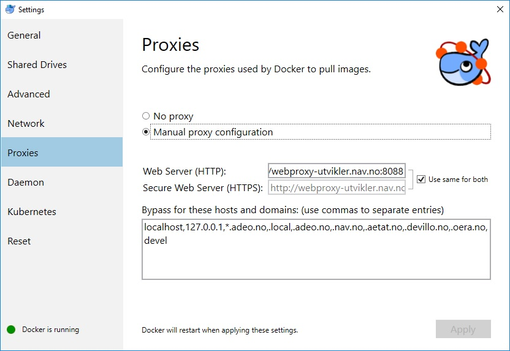

# okosynk
Applikasjon for å synkronisere oppgaver fra økonomisystemene OS (Oppdragssystemet) og UR (Utbetalingsreskontro) mot oppgave-applikasjonen (tidligere Gsak).
Applikasjonen leser flatfiler bestående av meldinger fra OS og UR. Noen av meldingene aggregeres
dersom de gjelder samme oppgave. Fra de resterende meldingene opprettes det oppgaver, og det er
disse oppgavene som skal ligge i oppgave-applikasjonen.

* Oppgaver som ligger i oppgave-applikasjonen, men ikke er tilstede i flatfil, ferdigstilles.
* Oppgaver som ligger både i oppgave-applikasjonen og i flatfil oppdateres med ny informasjon.
* Oppgaver som ligger i flatfil men ikke i oppgave-applikasjonen blir opprettet i oppgave-applikasjonen.

### Lokal utvikling

Hvis du har gjort endringer i koden, kjør `docker-compose build`.
Kjør `docker-compose run okosynk` for å kjøre appen, slik
som oppført i docker-compose.yml.
## Lokal testing
1. Kopiér `web/src/test/resources/environment-test.properties.default` til `environment-test.properties` og editér innholdet i henhold til hva som ønskes testet.
0. Pakk ut `domain/src/test/resources/os.input.valid.per.2018-05-04.zip` i samme directory. Hvorvidt navnet på fila da er korrekt, avhenger av no.nav.okosynk.OkosynkDomainConstants.OS_FS_INPUT_FILE_NAME i domain-modulen, evt. filnavnet som implisitt er angitt i `osFtpBaseUrl.url`-property'en hvis man skal teste FTP.
0. Pakk ut `domain/src/test/resources/ur.input.valid.per.2018-05-04.zip` i samme directory. Hvorvidt navnet på fila da er korrekt, avhenger av no.nav.okosynk.OkosynkDomainConstants.UR_FS_INPUT_FILE_NAME i domain-modulen, evt. filnavnet som implisitt er angitt i `urFtpBaseUrl.url`-property'en hvis man skal teste FTP.
0. Start Jetty-serveren som er definert i `no.nav.okosynk.TestStarter` under `okosynk/web/src/test/java`. (Dette gjøres vel enklest fra IDE'en.) (Kjøres via port 2712)
0. Start en batch-jobb ved å kjøre følgende kommando fra kommandolinja: `curl -X POST -u srvokosynk:byttmeg -i localhost:2712/okosynk/tjenester/os/batch/launch`. Verdien til `byttmeg` finnes i Fasit. Verdi pr. 2018-05-04: `VIx3ZYEzBemO6m5` i t4. `os` kan selvsagt byttes ut med `ur`.

0. Resultatet kan kontrolleres...
    1. ... ved å se på loggene. Se særlig etter strengen `STATISTIKK`. Loggen konfigureres i `okosynk/web/src/test/resources/logback-test.xml`.
    0. ... ved å kjøre SQL mot oppgave-databasen  i det riktige `t`-miljøet, f.eks. `t4`. DataSource finner du i Fasit for det aktuelle `t`-miljøet til oppgave-applikasjonen.
    1. Nyttge SQL-statements:   
            
            ```
            SELECT COUNT(*)
                FROM t_oppgave o
                WHERE o.k_fagomrade = 'OKO'
                    AND o.opprettet_av = 'srvokosynk'
                    AND o.k_oppgave_t = 'OKO_UR';
            ```

            ```
           SELECT e.NUMMER, o.K_UNDERKATEGORI, COUNT(*) AS antall
           FROM T_OPPGAVE o, T_ORG_ENHET e
           WHERE
               o.K_OPPGAVE_T = 'OKO_OS'
               AND o.ENDRET_AV = 'srvokosynk'
               AND o.DATO_ENDRET >= to_timestamp('2017-09-20 0800','YYYY-MM-DD HH24MI')
               AND o.ORG_ENHET_ID_ANSV = e.ORG_ENHET_ID
           GROUP BY e.nummer, o.K_UNDERKATEGORI;
           ```

           ```
           CREATE TYPE strings AS TABLE OF VARCHAR2(40);
           /
           CREATE TYPE numbers AS TABLE OF NUMBER(10);
           /
           SELECT
               TO_CHAR(dato_endret   , 'YYYY-MM-DD') AS Dato_endret
             , COUNT(*)                              AS Count
             , MIN(TO_CHAR(dato_opprettet, 'YYYY-MM-DD HH24:MI:SS')) AS Earliest_insertion
             , MAX(TO_CHAR(dato_opprettet, 'YYYY-MM-DD HH24:MI:SS')) AS Latest_insertion
             , MIN(TO_CHAR(dato_endret   , 'YYYY-MM-DD HH24:MI:SS')) AS Earliest_update
             , MAX(TO_CHAR(dato_endret   , 'YYYY-MM-DD HH24:MI:SS')) AS Latest_update
             , CAST(COLLECT(DISTINCT k_oppgave_t ) AS strings) AS oppgave_typer
             , CAST(COLLECT(DISTINCT opprettet_av) AS strings) AS opprettet_av
             , CAST(COLLECT(DISTINCT endret_av   ) AS strings) AS endret_av
             , CAST(COLLECT(DISTINCT versjon     ) AS numbers) AS versjoner
           FROM     t_oppgave
           GROUP BY TO_CHAR(dato_endret, 'YYYY-MM-DD')
           ORDER BY 1 DESC
           /
           DROP TYPE strings;
           /
           DROP TYPE numbers;
           ```

           ```
           CREATE TYPE strings AS TABLE OF VARCHAR2(40);
           /
           CREATE TYPE numbers AS TABLE OF NUMBER(10);
           /
           SELECT    TO_CHAR(dato_opprettet, 'YYYY-MM-DD') AS Dato_opprettet
                   , TO_CHAR(dato_endret, 'YYYY-MM-DD') AS Dato_endret
                   , COUNT(*) AS Count
                   , MIN(TO_CHAR(dato_opprettet, 'YYYY-MM-DD HH24:MI:SS')) AS Earliest_insertion
                   , MAX(TO_CHAR(dato_opprettet, 'YYYY-MM-DD HH24:MI:SS')) AS Latest_insertion
                   , MIN(TO_CHAR(dato_endret   , 'YYYY-MM-DD HH24:MI:SS')) AS Earliest_update
                   , MAX(TO_CHAR(dato_endret   , 'YYYY-MM-DD HH24:MI:SS')) AS Latest_update
                   , CAST(COLLECT(DISTINCT k_oppgave_t ) AS strings) AS oppgave_typer
                   , CAST(COLLECT(DISTINCT opprettet_av) AS strings) AS opprettet_av
                   , CAST(COLLECT(DISTINCT versjon     ) AS numbers) AS versjoner
           FROM     t_oppgave
           GROUP BY TO_CHAR(dato_opprettet, 'YYYY-MM-DD'), TO_CHAR(dato_endret, 'YYYY-MM-DD')
           ORDER BY 1 DESC, 2 DESC
           /
           DROP TYPE strings;
           /
           DROP TYPE numbers;
           ```
0. Noter
    1. Okosynk må gå mot oppgave-applikasjonen i et t-miljø, for å ha tilgang til en service gateway som kan oversette sitt
       SAML-token til en LTPA-token.
    0. En flatfil kan kjøres flere ganger. En oppgave vil oppdateres tilsvarende endringene i flatfilen hver gang, men kun ferdigstilles hvis det har gått lengre tid enn 8 timer siden sist oppgaven ble endret.

# Bygg av okosynk

1. Du trenger Docker installert på maskinen.
2. CD &lt;project root&gt;/
3. Kjør `docker build -t okosynk .` (Legg godt merke til at kommandoen slutter med blank og punktum):
Denne kommandoen vil bygge Docker-imaget basert på det som står i &lt;project root&gt;/Dockerfile.

(Hvis du har problemer med å kjøre denne docker-kommandoen, forsøk å kjøre factory reset med påfølgende restart. Husk også at hvis du kjører factory reset, da må du også sette proxy-konfigurasjonen på nytt, se under. Dessverre et dette en fix som tar rundt en kvart dag :-( )
### Last opp bygd artifakt
Husk: Windows: Docker |  Settings | Proxies: ALT det følgende må settes:


Use same for both: ```http://webproxy-utvikler.nav.no:8088```
Use no proxy for : ```localhost,127.0.0.1,*.adeo.no,.local,.adeo.no,.nav.no,.aetat.no,.devillo.no,.oera.no,devel```

Finn på en passende `<versjon>`, og kjør (legg godt merke til at den første kommandoen slutter med blank og punktum):
```
docker build -t repo.adeo.no:5443/okosynk:<version> .
docker login -u <uid> -p <password> repo.adeo.no:5443
docker push repo.adeo.no:5443/okosynk:<version>
```
(The uid and pwd are your ldap/AD NAV user logon ident, like e.g. R149852)
### Deploy til Kubernetes
Gjøres vha. [okosynk-deploy](https://github.com/navikt/okosynk-deploy)

## Testing i f.eks. Q:
Se ```https://github.com/navikt/okosynk-deploy```

## Kjøring
Se ```https://github.com/navikt/okosynk-deploy```

### Logging
Hver batch har sin egen logg-fil, i tillegg logger hver batch alle tjenestekall til sensitiv logg.

### Properties
Ved lokal utvikling benyttes `environment-test.properties` for properties som vanligvis vil ligge i Fasit. 

### Testing
Tester kjøres hver gang man bygger okosynk.

### Relevante lenker
[Jenkins okosynk - application and docker image build](http://vegard-jenkins.adeo.no/job/okosynk/)<BR/>
[okosynk-deploy](https://github.com/navikt/okosynk-deploy)<BR/>
