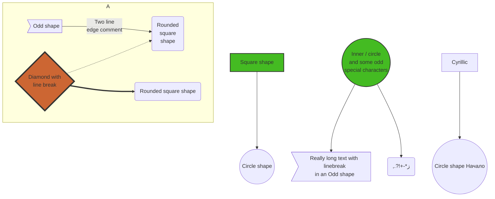

```mermaid
classDiagram
    CliMain <|-- AveryLongClass : Cool
    CliMain : int chimp
    CliMain : main()
    CliMain --> Interface01 : Down
    Class03 *-- Class04
    Class05 o-- Class06
    Class07 .. Class08
    Class09 --> C2 : Where am i?
    Class09 --* C3
    Class09 --|> Class07
    Class07 : equals()
    Class07 : Object[] elementData
    AveryLongClass : someMethod()
    Interface01 <|.. AveryLongClass
    Interface01 : size()
    Interface01 : int chimp
