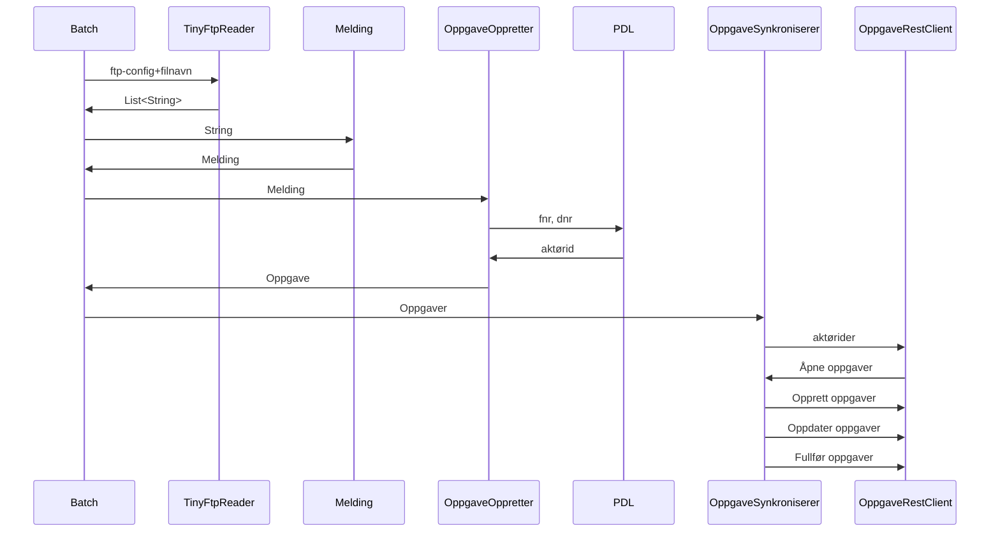

# Flyten i en synk

Batchen bruker TinyFtpReader til å lese fila. Rene tekstlinjer sendes tilbake. 

```mermaid
sequenceDiagram
    Batch               ->> TinyFtpReader        : ftp-config+filnavn
    TinyFtpReader       ->> Batch                : List<String>
    Batch               ->> Melding              : String
    Melding             ->> Batch                : Melding
    Batch               ->> OppgaveOppretter     : Melding
    OppgaveOppretter    ->> PDL                  : fnr, dnr
    PDL                 ->> OppgaveOppretter     : aktørid
    OppgaveOppretter    ->> Batch                : Oppgave
    Batch               ->> OppgaveSynkroniserer : Oppgaver
    OppgaveSynkroniserer->> OppgaveRestClient    : aktørider
    OppgaveRestClient   ->> OppgaveSynkroniserer : Åpne oppgaver
    OppgaveSynkroniserer->> OppgaveRestClient    : Opprett oppgaver
    OppgaveSynkroniserer->> OppgaveRestClient    : Oppdater oppgaver
    OppgaveSynkroniserer->> OppgaveRestClient    : Fullfør oppgaver
```
