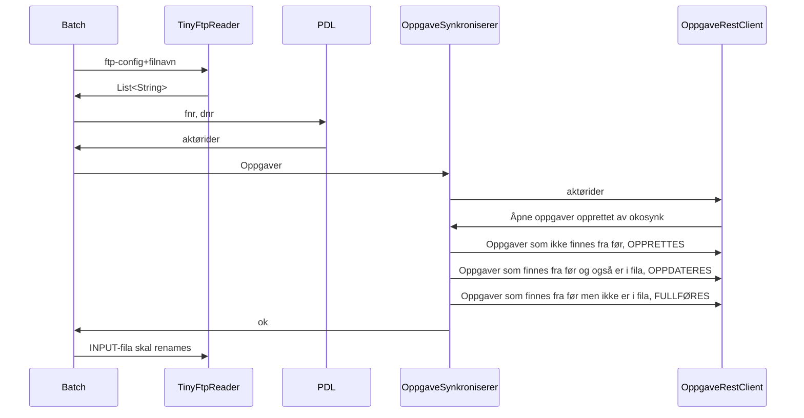

# Flyten i en synk

Batchen bruker TinyFtpReader til å lese fila. Rene tekstlinjer sendes tilbake. 

# Likhetskriterier
Samme gjelderId, gjelderIdType, ansvarligEnhetId.

...men gjelderIdType utledes fra gjelderId såeh...

I tillegg skiller 
OS på faggruppe og
UT på oppdragsKode
