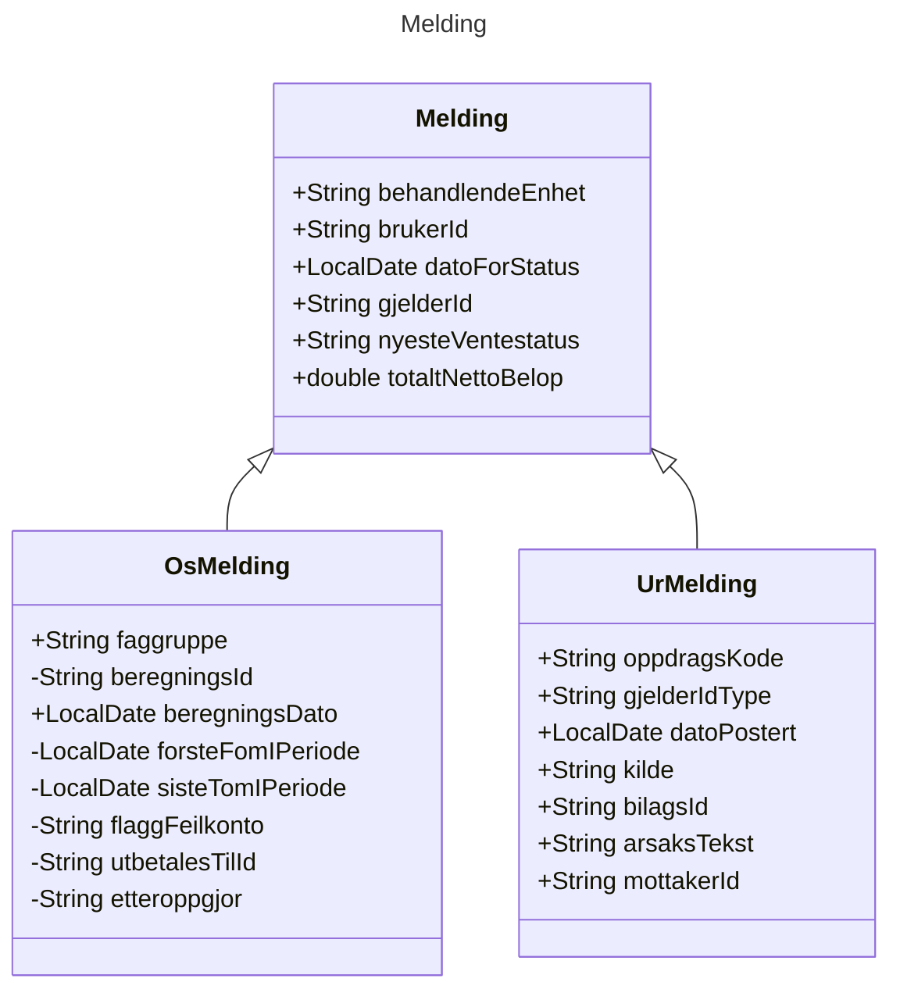

3,

1415926535897932384626433
8327950288419716939937510
5820974944592307816406286
2089986280348253421170679

8214808651328230664709384
4609550582231725359408128
4811174502841027019385211
0555064462294895493038196

4428810975665933446128475
6482337867831652712019091
45648566921384146
