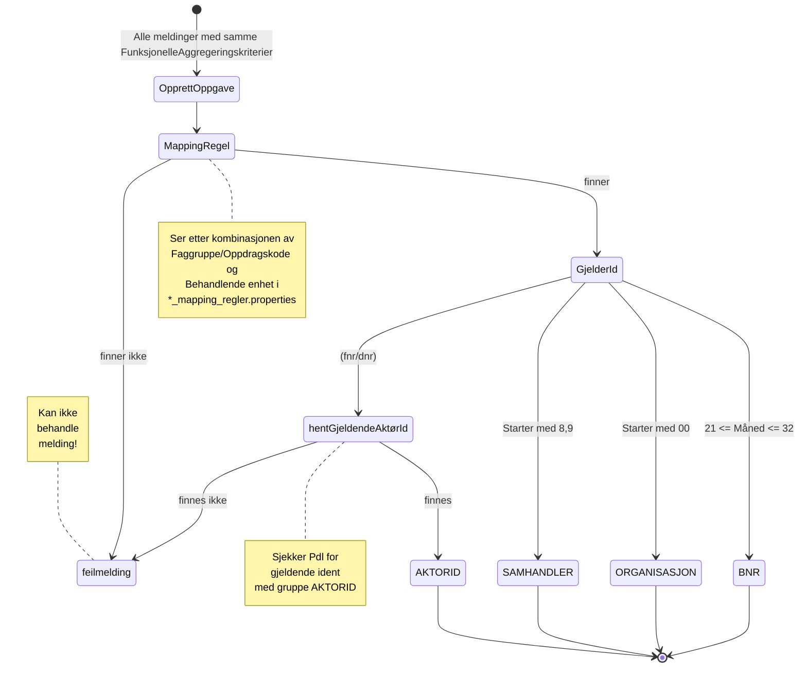

# Opprette oppgaver

## Aggregering
Først deles oppgavene inn etter FunksjonelleAggregeringskriterier

### OsMeldingFunksjonelleAggregeringsKriterier
Meldinger fra OS deles inn etter Faggruppe, GjelderId, GjelderIdType og AnsvarligEnhetId.

### UrMeldingFunksjonelleAggregeringsKriterier
Meldinger fra UR deles inn etter Oppdragskode, GjelderId, GjelderIdType og AnsvarligEnhetId.

## Opprettelse av oppgave

